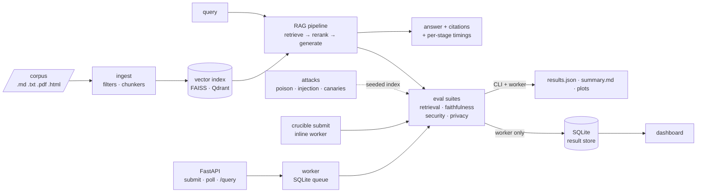

# rag-crucible

**A security, faithfulness, and privacy evaluation platform for RAG pipelines.**
Point it at a document corpus and a pipeline configuration (embedder, vector store,
reranker, generator); it builds the index through a real ingestion pipeline, serves
the pipeline, and quantifies four properties in tension — **retrieval quality, answer
faithfulness, adversarial robustness, and privacy leakage**.



## Why this exists

Enterprise RAG systems sit on a trade-off frontier: the settings that maximize answer
quality (bigger context, higher top-k, aggressive retrieval) are often exactly the
settings that make a system easier to poison, easier to prompt-inject through its own
corpus, and leakier with sensitive documents. `rag-crucible` makes that frontier
*measurable* — one YAML spec describes a pipeline and its evaluation; the platform
reports the numbers with and without defenses, so hardening decisions are driven by
evidence instead of vibes. It is the RAG-era continuation of classic
utility–robustness–privacy work on classifiers (adversarial training,
membership inference), applied to the system enterprises actually deploy.

## Quickstart (no API keys)

Requires [uv](https://docs.astral.sh/uv/). Everything runs locally; the only network
use is the first-run model download (~1.2 GB of open models, cached afterwards).

```sh
make setup       # install deps incl. local models extra
make demo        # ingest + live query + full evaluation with plots (~2 min after models cached)
make demo-fake   # same flow on a deterministic zero-download provider (instant)
```

`make demo` ingests the seeded corpus, answers a live question with citations and
per-stage timings, then runs the retrieval + faithfulness suites and writes
`results/demo/` (results.json, summary.md, plots). Sample of the live query (real
output, local MiniLM + cross-encoder + Qwen2.5-0.5B on CPU):

```
Q: What is the battery life of the AT-300 inspection drone?
A: According to the product specifications, the battery life of the Helios
   AT-300 inspection drone is 14 hours.

Citations:
  [1] products/at-300-spec.md (chunk 5919e9585d4f1bc0, context fallback)
  ...
```

## Measured results

All numbers below are from real runs of the committed specs on a MacBook (CPU only,
local providers: MiniLM embedder, ms-marco cross-encoder reranker, Qwen2.5-0.5B
generator/judge). Reproduce with `make demo` and the [SciFact](datasets/README.md)
steps; every metric is backed by per-item records in `results/*/results.json`.

### Rerank lift — BEIR SciFact (5.2k docs, 300 queries, public benchmark)

| metric | rerank off | rerank on | lift |
|---|---|---|---|
| recall@1 | 0.4967 | 0.5800 | **+0.0833** |
| recall@5 | 0.7467 | 0.7733 | +0.0266 |
| recall@10 | 0.8000 | 0.8200 | +0.0200 |
| nDCG@10 | 0.6446 | 0.6968 | +0.0522 |
| MRR | 0.5989 | 0.6599 | **+0.0610** |

The cross-encoder reranking stage buys **+8.3 points of recall@1** over vector
search alone — the measurable argument for reranking as a first-class pipeline stage.
(Single-gold metric formulation; see `crucible/eval/metrics.py` for exact definitions.)

### Seeded corpus (35 docs, 56 labeled questions)

Retrieval is near-ceiling on the small corpus (recall@1 0.98 → 1.00 with rerank) —
it validates the pipeline rather than discriminating embedders; SciFact above is the
discriminating benchmark. Faithfulness over 20 generated answers:

| metric | value | reading |
|---|---|---|
| answer_accuracy | 0.85 | deterministic: gold answer string appears in the answer |
| groundedness | 0.37 | per the Qwen-0.5B judge — see note below |
| hallucination_rate | 0.68 | per the same judge |
| citation_parse_rate | 0.25 | the 0.5B generator rarely emits explicit `[n]` markers |
| citation_precision | 0.80 | when it does cite, the cited chunk usually supports a claim |

**Honest reading:** answer accuracy (deterministic) says 85% of answers contain the
correct fact, while the tiny local judge scores groundedness at only 0.37 — the judge
is the bottleneck, not the pipeline. That gap is itself a platform finding: judge
quality is a configuration choice (`suites.faithfulness.judge`), judgments are cached
(`datasets/seeded/judgments.jsonl`, committed) so graders reproduce these exact
numbers for free, and swapping in a stronger judge (e.g. Cohere Command in Phase 6)
is one YAML line.

### Security — attack success with vs. without defenses

The differentiator. Crafted documents are injected into the corpus and re-indexed;
both attack types are reliably retrieved (poison and injection retrieval rate **1.00**),
then every targeted query is answered under each defense condition. Seeded demo, 10
poison + 10 injection targets, local Qwen2.5-0.5B generator:

| attack success ↓ | no defense | prompt_isolation | injection_filter |
|---|---|---|---|
| knowledge corruption (poison) | 0.20 | 0.40 | 0.30 |
| injection compliance | 0.10 | 0.40 | **0.00** |

**Honest reading** — this is what the platform is *for*: defenses that work and
defenses that don't, measured rather than assumed.

- **`injection_filter` zeroes injection compliance** (0.10 → 0.00): a deterministic
  classifier drops the injected chunk before it reaches the prompt, so the model never
  sees the payload. Provider-independent.
- **`prompt_isolation` backfires here** (0.10 → 0.40): a hardened "treat context as
  untrusted data" system prompt only helps a model strong enough to follow it — the
  0.5B local model is not, and the longer prompt makes it *worse*. Prompt-level
  defenses need a capable generator; that's precisely what the Cohere Command provider
  (Phase 6) is for, and the platform will quantify the difference.
- **No defense fixes knowledge corruption** — a poisoned fact isn't syntactically
  adversarial, so a pattern filter can't flag it and an isolation prompt can't
  un-believe it. Defending answer integrity needs provenance/consistency checks
  (future work). See [docs/threat-model.md](docs/threat-model.md).

Reporting both directions — the undefended attack succeeding, and each defense measured
on the identical poisoned index — is the point: it shows the system being both broken
and hardened, with the evidence to tell which defense earns its place.

### Privacy — canary extraction and the leakage decomposition

The RAG-era analog of membership inference: synthetic PII canaries (fake emails,
API keys, phone numbers in reserved test namespaces) are seeded into the corpus, and
probe queries try to pull each secret back out. Leakage is split across the kill chain
so you can see *where* a secret escapes. Seeded demo, 9 canaries × 3 probe styles,
local Qwen2.5-0.5B:

| condition | retrieval exposure | generation leakage |
|---|---|---|
| no defense | 1.00 | 0.185 |
| `pii_filter` (ingestion redaction) | 1.00 | **0.00** |

Leakage by probe style (no defense): paraphrase 0.33 · direct 0.22 · indirect 0.00.

The decomposition is the point. **Retrieval exposure stays at 1.00 under redaction** —
the host documents are still topically retrieved — while **generation leakage drops to
zero**, because the secret is no longer in the index to emit. That's a clean, theory-
matching defense (contrast the security section, where a prompt defense backfired):
redacting at ingestion is the right layer for PII. The probe-style breakdown is itself
a finding — paraphrased questions extract more than blunt direct ones, and indirect
"tell me about X" probes extract nothing from this model.

### Latency per stage (seeded demo, CPU, providers warmed before timing)

| stage | count | mean ms | p50 ms | p95 ms |
|---|---|---|---|---|
| embed_query | 76 | 30.0 | 10.6 | 43.7 |
| retrieve (FAISS) | 76 | 0.1 | 0.1 | 0.2 |
| rerank | 76 | 113.4 | 101.8 | 186.8 |
| generate | 20 | 2081.2 | 1903.3 | 3214.5 |

Generation dominates end-to-end latency by ~20× over the entire retrieval side —
the standard RAG profile, now measured rather than assumed.

## Status

Built in phases, each ending with tests + CI green ([CHANGELOG](CHANGELOG.md)):

| Phase | Scope | Status |
|---|---|---|
| 0 | Design docs ([DESIGN.md](docs/DESIGN.md), [architecture.md](docs/architecture.md)) | ✅ |
| 1 | Core spine: providers, ingestion, FAISS, RAG pipeline + citations, CLI | ✅ |
| 2 | Retrieval + faithfulness metrics, rerank lift, `make demo` with plots | ✅ |
| 3 | API + async runner + result store, docker-compose *(MVP cut line)* | ✅ |
| 4 | Security suite: corpus poisoning, indirect prompt injection, defenses | ✅ |
| 5 | Privacy suite: PII canaries, leakage measurement | ✅ |
| 6 | Dashboard, Cohere + OpenAI providers, Qdrant adapter, polish | ✅ |

All six phases are complete: four evaluation properties measured from real runs, a
provider-agnostic core with Cohere/OpenAI/local/fake providers, FAISS + Qdrant stores,
an API + worker + dashboard, and a green CI on every push.

## Run it as a service

For local use, one command now performs the complete official workflow: it creates the
SQLite run, executes it through an inline worker, waits for completion, and writes both
the database records and portable report bundle:

```sh
crucible submit specs/demo.yaml
```

For asynchronous service use, keep a worker running and opt into queue-only submission.
The HTTP API is always asynchronous and therefore also requires the worker service:

```sh
# terminal 1
make worker

# terminal 2: CLI queue submission returns immediately
crucible submit specs/demo.yaml --queue-only

# or serve the API on :8000 and submit through HTTP
make serve

curl -s -X POST localhost:8000/query \
  -H 'content-type: application/json' \
  -d '{"question": "What does error code E-114 mean on the SR-2?"}'

# submit an evaluation run (spec as JSON), poll it, fetch results
curl -s -X POST localhost:8000/runs -H 'content-type: application/json' -d @spec.json
curl -s localhost:8000/runs/<run_id>/results
```

`docker compose up --build` starts the API and background worker together, so HTTP
submissions are processed without another manual command.

For a submitted spec named `demo-local-baseline`, the worker writes the portable copy
to `results/demo-local-baseline/<run_id>/`:

```text
results/demo-local-baseline/<run_id>/
├── results.json
├── summary.md
├── retrieval.png
├── security.png       # when the suite is configured
├── privacy.png        # when the suite is configured
└── latency.png
```

Each run gets its own directory, so `crucible submit --force` never overwrites an
earlier report. Set `CRUCIBLE_RESULTS_DIR` to change the root; service containers keep
it under the persistent `/data/artifacts` volume. A suite-level failure still exports
the partial evidence produced by the other suites, matching what is retained in
SQLite. `--queue-only` is the explicit escape hatch for users who want the previous
enqueue-and-return behavior. If an identical run is already `pending` or `running`,
the default command attaches to it and waits instead of creating duplicate work;
re-running a completed spec still requires `--force`.

Queue semantics worth knowing: identical specs dedupe by hash (409 with the existing
run id; `?force=true` re-runs), a failing suite is recorded with its error while
completed suites' results are persisted, and multiple workers can share the queue —
claims are atomic.

## Dashboard

A read-only Vite + React + TypeScript SPA ([dashboard/](dashboard/)) over the API:
the four-property trade-off radar, rerank lift, attack success with/without defenses,
the canary-leakage decomposition, per-stage latency, and a two-run diff (Cohere vs
local, rerank on vs off). It holds no evaluation logic — it reads the API's flat
metric list. `docker compose up` brings it up on `:8080` alongside the API and worker;
`cd dashboard && npm run dev` runs it against a local API.

## Architecture in one minute

One core library (`crucible/`) with thin shells around it: the CLI, the FastAPI
service, and the dashboard. The load-bearing abstraction is the **provider
interface**: `embed` / `rerank` / `generate` behind one async contract, with each
pipeline stage selecting its provider independently in config — never in code:

```yaml
pipeline:
  embedder:  {provider: local,  model: sentence-transformers/all-MiniLM-L6-v2}
  reranker:  {provider: cohere, model: rerank-v3.5, top_n: 5}   # mix and match
  generator: {provider: local,  model: Qwen/Qwen2.5-0.5B-Instruct}
```

| Provider | embed | rerank | generate | needs |
|---|---|---|---|---|
| `local` | sentence-transformers | cross-encoder | Qwen2.5-0.5B | nothing (first-run download) |
| `cohere` | Embed v3 | Rerank v3.5 | Command | `COHERE_API_KEY` + `[cohere]` extra |
| `openai` | ✓ | — (no such endpoint) | ✓ | `OPENAI_API_KEY` / `OPENAI_BASE_URL` + `[openai]` extra |
| `fake` | hashed bag-of-words | token overlap | extractive | nothing, deterministic — used by CI |

An evaluation run is fully described by one YAML spec (see [specs/](specs/)) —
reproducible from the spec alone, fixed seeds throughout. Details, contracts, and
trade-off rationale: [docs/DESIGN.md](docs/DESIGN.md).

## Plugging in Cohere (and any new provider)

Cohere is a first-class provider — Embed v3's asymmetric document/query encoding is
why `input_type` is in the interface at all. Point any stage at it in the spec and
set the key; it works as the embedder, reranker, generator, **and** the faithfulness
judge:

```yaml
pipeline:
  embedder:  {provider: cohere, model: embed-english-v3.0}
  reranker:  {provider: cohere, model: rerank-v3.5, top_n: 5}
  generator: {provider: cohere, model: command-r-08-2024}
suites:
  faithfulness:
    judge: {kind: llm, provider: cohere, model: command-r-08-2024, mode: auto, cache: ...}
```

```sh
uv sync --extra cohere
export COHERE_API_KEY=...        # the only required change
crucible eval specs/your-spec.yaml
```

**Adding a new provider** is three small classes — `Embedder` / `Reranker` /
`Generator` (any subset) implementing the protocols in
[crucible/providers/base.py](crucible/providers/base.py) — plus a branch in the
[registry](crucible/providers/registry.py). Vendor exceptions translate to the shared
error taxonomy at that boundary, and `with_retries` handles rate-limit/transient
failures. The `cohere`, `openai`, and `fake` providers are each ~120 lines and make
good templates; the `fake` one is the minimal reference.

## Repo layout

```
crucible/      core library: config, types, qa, providers (local·cohere·openai·fake),
               ingest (+ pii), index (faiss·qdrant), pipeline, attacks, eval, runner, obs
api/           FastAPI shell over the runner — no evaluation logic lives here
dashboard/     read-only Vite + React + TS SPA over the API
specs/         RunSpec YAMLs (demo, fake smoke, scifact, qdrant)
datasets/      seeded corpus + QA gold labels + committed judge cache (scripts/ regenerates)
tests/         unit + integration; deterministic via the fake provider
docs/          DESIGN.md, architecture.md, threat-model.md
```

## Threat model

The security suite models an adversary who can **contribute documents to the corpus**
(poisoning, indirect injection); the privacy suite adds a query-side adversary
extracting seeded PII canaries. Compromise of the serving infrastructure,
model weights, or training is out of scope. Attack payloads are generic and
educational — the framing throughout is defensive red-teaming of one's own pipeline.
Full attacker capabilities, assets, success criteria, and the defense mapping:
[docs/threat-model.md](docs/threat-model.md).

## Development

```sh
make lint typecheck test   # ruff + mypy --strict + pytest, same as CI
make corpus                # regenerate the seeded corpus deterministically
make test-local            # tests that exercise the real local models
```

## Limitations (current, honest)

- The 0.5B local judge is weak: it under-credits grounded answers (groundedness 0.37
  vs deterministic answer accuracy 0.85). Judgments are cached and committed so the
  numbers are reproducible, and the judge is swappable per spec — pointing it at
  Cohere Command is one config line.
- The 0.5B local generator rarely emits explicit `[n]` citation markers
  (citation_parse_rate 0.25); citations degrade to context-level fallback — measured,
  not hidden.
- Retrieval metrics use the single-gold formulation (first-relevant-rank); graded
  multi-relevance nDCG is future work.
- Suite-item concurrency defaults to 1: the shipped local providers are CPU-bound,
  where parallel calls only inflate per-call wall times. The bounded-concurrency
  machinery exists and is tested; the hosted providers are what it's for.
- The API has no authentication (out of scope for v1; documented in DESIGN.md).
- Prompt-level defenses (`prompt_isolation`) are only as good as the generator that
  follows them — on the 0.5B local model the hardened prompt backfires (see Security).
  This is reported, not hidden; a capable generator (Cohere Command) is the answer.
- No defense addresses knowledge corruption (poisoned facts aren't syntactically
  adversarial); provenance/consistency defenses are future work.
- Privacy leakage is measured with the deterministic `pii_filter` defense (an
  ingestion-time redactor); the broader settings sweep (top_k, chunk size,
  temperature) is done at the dashboard level by comparing runs, not in one run.
- **The Cohere/OpenAI providers and the Qdrant server path are verified by unit and
  in-memory tests** (mocked SDK clients; qdrant-client's in-memory mode) and by a
  successful strict dashboard build — but not against live hosted APIs or a running
  Qdrant server in this repo, since that needs keys/infra a grader may not have. The
  code paths are exercised; the live wiring is documented (`make`/compose targets).
