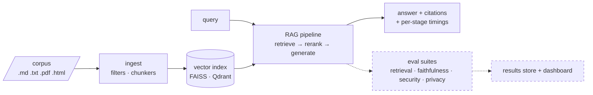

# rag-crucible

**A security, faithfulness, and privacy evaluation platform for RAG pipelines.**
Point it at a document corpus and a pipeline configuration (embedder, vector store,
reranker, generator); it builds the index through a real ingestion pipeline, serves
the pipeline, and quantifies four properties in tension — **retrieval quality, answer
faithfulness, adversarial robustness, and privacy leakage**.



*(dashed = lands in Phases 2–6; solid = working today)*

## Why this exists

Enterprise RAG systems sit on a trade-off frontier: the settings that maximize answer
quality (bigger context, higher top-k, aggressive retrieval) are often exactly the
settings that make a system easier to poison, easier to prompt-inject through its own
corpus, and leakier with sensitive documents. `rag-crucible` makes that frontier
*measurable* — one YAML spec describes a pipeline and its evaluation; the platform
reports the numbers with and without defenses, so hardening decisions are driven by
evidence instead of vibes. It is the RAG-era continuation of classic
utility–robustness–privacy work on classifiers (adversarial training,
membership inference), applied to the system enterprises actually deploy.

## Quickstart (no API keys)

Requires [uv](https://docs.astral.sh/uv/). Everything runs locally; the only network
use is the first-run model download (~1.2 GB of open models, cached afterwards).

```sh
make setup       # install deps incl. local models extra
make demo        # ingest the seeded corpus + answer 3 questions end-to-end
make demo-fake   # same spine on a deterministic zero-download provider (instant)
```

What `make demo` looks like (real output, local MiniLM + cross-encoder + Qwen2.5-0.5B
on CPU):

```
Q: What is the battery life of the AT-300 inspection drone?
A: According to the product specifications, the battery life of the Helios
   AT-300 inspection drone is 14 hours.

Citations:
  [1] products/at-300-spec.md (chunk 5919e9585d4f1bc0, context fallback)
  ...
Timings (ms): embed 4078.1 | retrieve 1.5 | rerank 1829.3 | generate 5778.0 | total 11686.9
```

Answers carry **citations** (which chunks were used, and whether the model cited them
explicitly or they're context-level fallback) and **per-stage latency** — both are
load-bearing for the evaluation suites.

## Status

Built in phases, each ending with tests + CI green ([CHANGELOG](CHANGELOG.md)):

| Phase | Scope | Status |
|---|---|---|
| 0 | Design docs ([DESIGN.md](docs/DESIGN.md), [architecture.md](docs/architecture.md)) | ✅ |
| 1 | Core spine: providers, ingestion, FAISS, RAG pipeline + citations, CLI | ✅ |
| 2 | Retrieval + faithfulness metrics, rerank lift, `make demo` with plots | — |
| 3 | API + async runner + result store, docker-compose *(MVP cut line)* | — |
| 4 | Security suite: corpus poisoning, indirect prompt injection, defenses | — |
| 5 | Privacy suite: PII canaries, leakage measurement | — |
| 6 | Dashboard, Cohere provider first-class, Qdrant adapter, polish | — |

Measured results tables (retrieval metrics, rerank lift, hallucination rate,
attack-success with/without defenses, leakage rate) land here as each suite ships —
numbers from real runs, never invented.

## Architecture in one minute

One core library (`crucible/`), three thin shells (CLI now; API + dashboard later).
The load-bearing abstraction is the **provider interface**: `embed` / `rerank` /
`generate` behind one async contract, with each pipeline stage selecting its provider
independently in config — never in code:

```yaml
pipeline:
  embedder:  {provider: local,  model: sentence-transformers/all-MiniLM-L6-v2}
  reranker:  {provider: cohere, model: rerank-v3.5, top_n: 5}   # mix and match
  generator: {provider: local,  model: Qwen/Qwen2.5-0.5B-Instruct}
```

| Provider | embed | rerank | generate | needs |
|---|---|---|---|---|
| `local` | sentence-transformers | cross-encoder | Qwen2.5-0.5B | nothing (first-run download) |
| `cohere` *(Phase 6)* | Embed v3 | Rerank v3.5 | Command | `COHERE_API_KEY` |
| `openai` *(Phase 6)* | ✓ | — (no such endpoint) | ✓ | `OPENAI_API_KEY` / any compatible server |
| `fake` | hashed bag-of-words | token overlap | extractive | nothing, deterministic — used by CI |

An evaluation run is fully described by one YAML spec (see [specs/](specs/)) —
reproducible from the spec alone, fixed seeds throughout. Details, contracts, and
trade-off rationale: [docs/DESIGN.md](docs/DESIGN.md).

## Repo layout

```
crucible/      core library: config, types, providers, ingest, index, pipeline, obs
specs/         RunSpec YAMLs (demo, fake smoke)
datasets/      seeded synthetic corpus + QA gold labels (+ generator script in scripts/)
tests/         unit + integration; deterministic via the fake provider
docs/          DESIGN.md, architecture.md (threat-model.md lands with Phase 4)
```

## Development

```sh
make lint typecheck test   # ruff + mypy --strict + pytest, same as CI
make corpus                # regenerate the seeded corpus deterministically
make test-local            # tests that exercise the real local models
```

## Limitations (current, honest)

- The 0.5B local generator rarely emits explicit `[n]` citation markers; citations
  then degrade to context-level fallback. This is reported, not hidden — marker
  compliance is one of the things the faithfulness suite (Phase 2) measures.
- First pipeline call pays model load (~4 s embed / ~6 s generate on CPU); steady-state
  is much faster. The runner (Phase 3) will warm providers before timing.
- Evaluation suites, API/runner, security/privacy modules, and the dashboard are
  designed (see DESIGN.md) but not yet built — see the phase table above.
