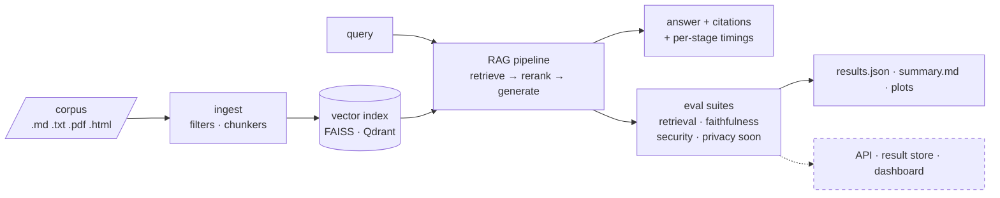

# rag-crucible

**A security, faithfulness, and privacy evaluation platform for RAG pipelines.**
Point it at a document corpus and a pipeline configuration (embedder, vector store,
reranker, generator); it builds the index through a real ingestion pipeline, serves
the pipeline, and quantifies four properties in tension — **retrieval quality, answer
faithfulness, adversarial robustness, and privacy leakage**.



*(dashed = lands in Phases 3–6; solid = working today)*

## Why this exists

Enterprise RAG systems sit on a trade-off frontier: the settings that maximize answer
quality (bigger context, higher top-k, aggressive retrieval) are often exactly the
settings that make a system easier to poison, easier to prompt-inject through its own
corpus, and leakier with sensitive documents. `rag-crucible` makes that frontier
*measurable* — one YAML spec describes a pipeline and its evaluation; the platform
reports the numbers with and without defenses, so hardening decisions are driven by
evidence instead of vibes. It is the RAG-era continuation of classic
utility–robustness–privacy work on classifiers (adversarial training,
membership inference), applied to the system enterprises actually deploy.

## Quickstart (no API keys)

Requires [uv](https://docs.astral.sh/uv/). Everything runs locally; the only network
use is the first-run model download (~1.2 GB of open models, cached afterwards).

```sh
make setup       # install deps incl. local models extra
make demo        # ingest + live query + full evaluation with plots (~2 min after models cached)
make demo-fake   # same flow on a deterministic zero-download provider (instant)
```

`make demo` ingests the seeded corpus, answers a live question with citations and
per-stage timings, then runs the retrieval + faithfulness suites and writes
`results/demo/` (results.json, summary.md, plots). Sample of the live query (real
output, local MiniLM + cross-encoder + Qwen2.5-0.5B on CPU):

```
Q: What is the battery life of the AT-300 inspection drone?
A: According to the product specifications, the battery life of the Helios
   AT-300 inspection drone is 14 hours.

Citations:
  [1] products/at-300-spec.md (chunk 5919e9585d4f1bc0, context fallback)
  ...
```

## Measured results

All numbers below are from real runs of the committed specs on a MacBook (CPU only,
local providers: MiniLM embedder, ms-marco cross-encoder reranker, Qwen2.5-0.5B
generator/judge). Reproduce with `make demo` and the [SciFact](datasets/README.md)
steps; every metric is backed by per-item records in `results/*/results.json`.

### Rerank lift — BEIR SciFact (5.2k docs, 300 queries, public benchmark)

| metric | rerank off | rerank on | lift |
|---|---|---|---|
| recall@1 | 0.4967 | 0.5800 | **+0.0833** |
| recall@5 | 0.7467 | 0.7733 | +0.0266 |
| recall@10 | 0.8000 | 0.8200 | +0.0200 |
| nDCG@10 | 0.6446 | 0.6968 | +0.0522 |
| MRR | 0.5989 | 0.6599 | **+0.0610** |

The cross-encoder reranking stage buys **+8.3 points of recall@1** over vector
search alone — the measurable argument for reranking as a first-class pipeline stage.
(Single-gold metric formulation; see `crucible/eval/metrics.py` for exact definitions.)

### Seeded corpus (35 docs, 56 labeled questions)

Retrieval is near-ceiling on the small corpus (recall@1 0.98 → 1.00 with rerank) —
it validates the pipeline rather than discriminating embedders; SciFact above is the
discriminating benchmark. Faithfulness over 20 generated answers:

| metric | value | reading |
|---|---|---|
| answer_accuracy | 0.85 | deterministic: gold answer string appears in the answer |
| groundedness | 0.37 | per the Qwen-0.5B judge — see note below |
| hallucination_rate | 0.68 | per the same judge |
| citation_parse_rate | 0.25 | the 0.5B generator rarely emits explicit `[n]` markers |
| citation_precision | 0.80 | when it does cite, the cited chunk usually supports a claim |

**Honest reading:** answer accuracy (deterministic) says 85% of answers contain the
correct fact, while the tiny local judge scores groundedness at only 0.37 — the judge
is the bottleneck, not the pipeline. That gap is itself a platform finding: judge
quality is a configuration choice (`suites.faithfulness.judge`), judgments are cached
(`datasets/seeded/judgments.jsonl`, committed) so graders reproduce these exact
numbers for free, and swapping in a stronger judge (e.g. Cohere Command in Phase 6)
is one YAML line.

### Latency per stage (seeded demo, CPU)

| stage | count | mean ms | p50 ms | p95 ms |
|---|---|---|---|---|
| embed_query | 76 | 119.7 | 9.4 | 347.3 |
| retrieve (FAISS) | 76 | 0.2 | 0.1 | 0.3 |
| rerank | 76 | 144.1 | 96.2 | 183.3 |
| generate | 20 | 2301.7 | 1957.1 | 4263.5 |

p95 ≫ p50 on embed reflects lazy model load on first call; the Phase 3 runner warms
providers before timing.

## Status

Built in phases, each ending with tests + CI green ([CHANGELOG](CHANGELOG.md)):

| Phase | Scope | Status |
|---|---|---|
| 0 | Design docs ([DESIGN.md](docs/DESIGN.md), [architecture.md](docs/architecture.md)) | ✅ |
| 1 | Core spine: providers, ingestion, FAISS, RAG pipeline + citations, CLI | ✅ |
| 2 | Retrieval + faithfulness metrics, rerank lift, `make demo` with plots | ✅ |
| 3 | API + async runner + result store, docker-compose *(MVP cut line)* | — |
| 4 | Security suite: corpus poisoning, indirect prompt injection, defenses | — |
| 5 | Privacy suite: PII canaries, leakage measurement | — |
| 6 | Dashboard, Cohere provider first-class, Qdrant adapter, polish | — |

Attack-success (with/without defenses) and privacy-leakage tables land with
Phases 4–5 — from real runs, never invented, like everything above.

## Architecture in one minute

One core library (`crucible/`), three thin shells (CLI now; API + dashboard later).
The load-bearing abstraction is the **provider interface**: `embed` / `rerank` /
`generate` behind one async contract, with each pipeline stage selecting its provider
independently in config — never in code:

```yaml
pipeline:
  embedder:  {provider: local,  model: sentence-transformers/all-MiniLM-L6-v2}
  reranker:  {provider: cohere, model: rerank-v3.5, top_n: 5}   # mix and match
  generator: {provider: local,  model: Qwen/Qwen2.5-0.5B-Instruct}
```

| Provider | embed | rerank | generate | needs |
|---|---|---|---|---|
| `local` | sentence-transformers | cross-encoder | Qwen2.5-0.5B | nothing (first-run download) |
| `cohere` *(Phase 6)* | Embed v3 | Rerank v3.5 | Command | `COHERE_API_KEY` |
| `openai` *(Phase 6)* | ✓ | — (no such endpoint) | ✓ | `OPENAI_API_KEY` / any compatible server |
| `fake` | hashed bag-of-words | token overlap | extractive | nothing, deterministic — used by CI |

An evaluation run is fully described by one YAML spec (see [specs/](specs/)) —
reproducible from the spec alone, fixed seeds throughout. Details, contracts, and
trade-off rationale: [docs/DESIGN.md](docs/DESIGN.md).

## Repo layout

```
crucible/      core library: config, types, providers, ingest, index, pipeline, eval, obs
specs/         RunSpec YAMLs (demo, fake smoke, scifact)
datasets/      seeded corpus + QA gold labels + committed judge cache (scripts/ regenerates)
tests/         unit + integration; deterministic via the fake provider
docs/          DESIGN.md, architecture.md (threat-model.md lands with Phase 4)
```

## Development

```sh
make lint typecheck test   # ruff + mypy --strict + pytest, same as CI
make corpus                # regenerate the seeded corpus deterministically
make test-local            # tests that exercise the real local models
```

## Limitations (current, honest)

- The 0.5B local judge is weak: it under-credits grounded answers (groundedness 0.37
  vs deterministic answer accuracy 0.85). Judgments are cached and committed so the
  numbers are reproducible, and the judge is swappable per spec; a stronger judge
  arrives with the Cohere provider in Phase 6.
- The 0.5B local generator rarely emits explicit `[n]` citation markers
  (citation_parse_rate 0.25); citations degrade to context-level fallback — measured,
  not hidden.
- Retrieval metrics use the single-gold formulation (first-relevant-rank); graded
  multi-relevance nDCG is future work.
- First pipeline call pays model load (visible as p95 ≫ p50 on embed); the Phase 3
  runner will warm providers before timing.
- API/runner, security/privacy suites, and the dashboard are designed (see
  DESIGN.md) but not yet built — see the phase table above.
