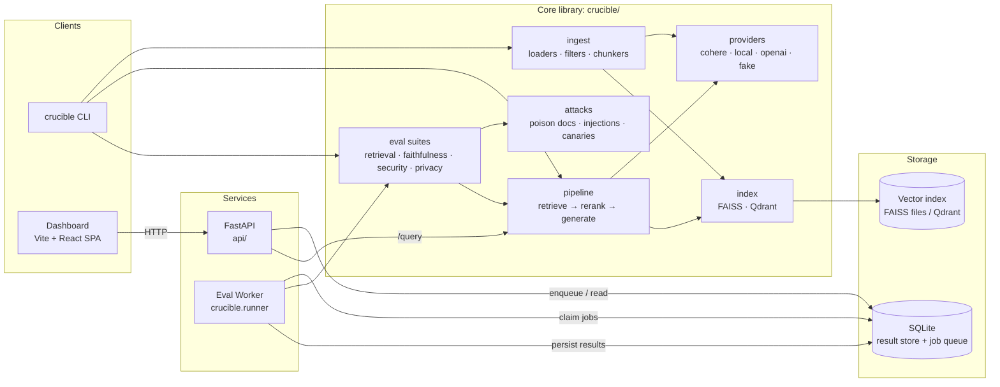
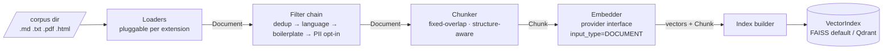
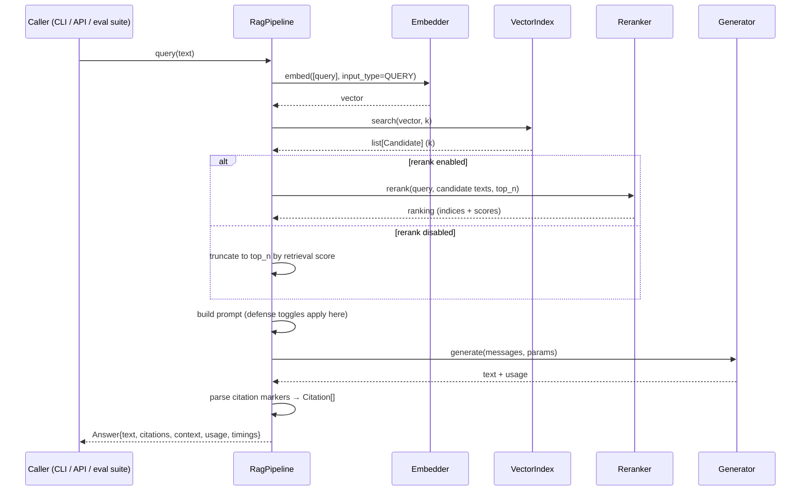
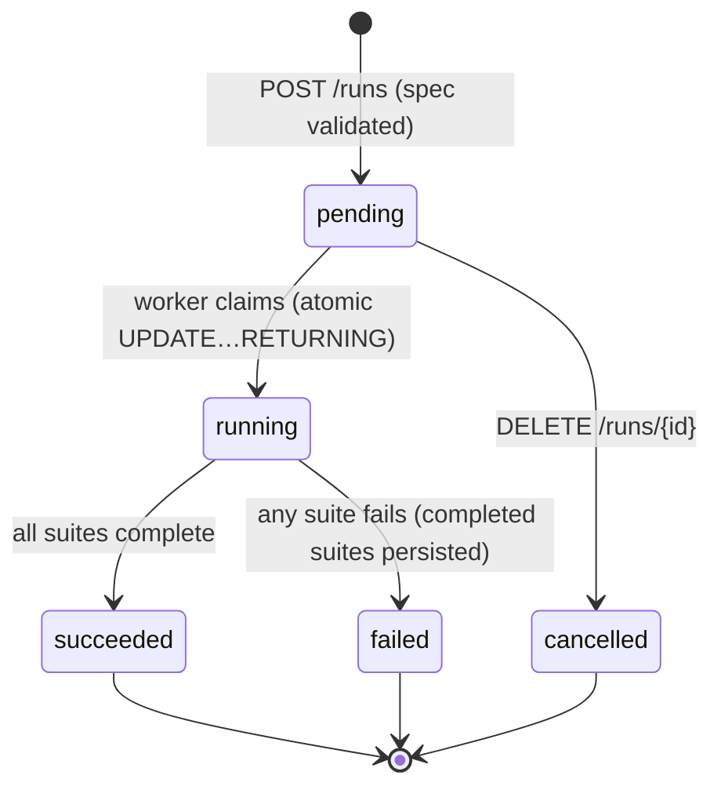
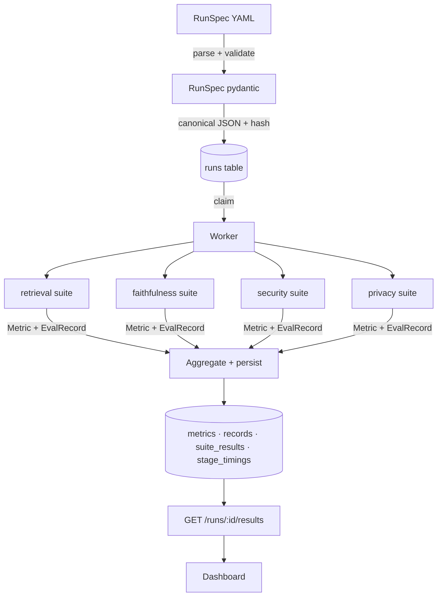
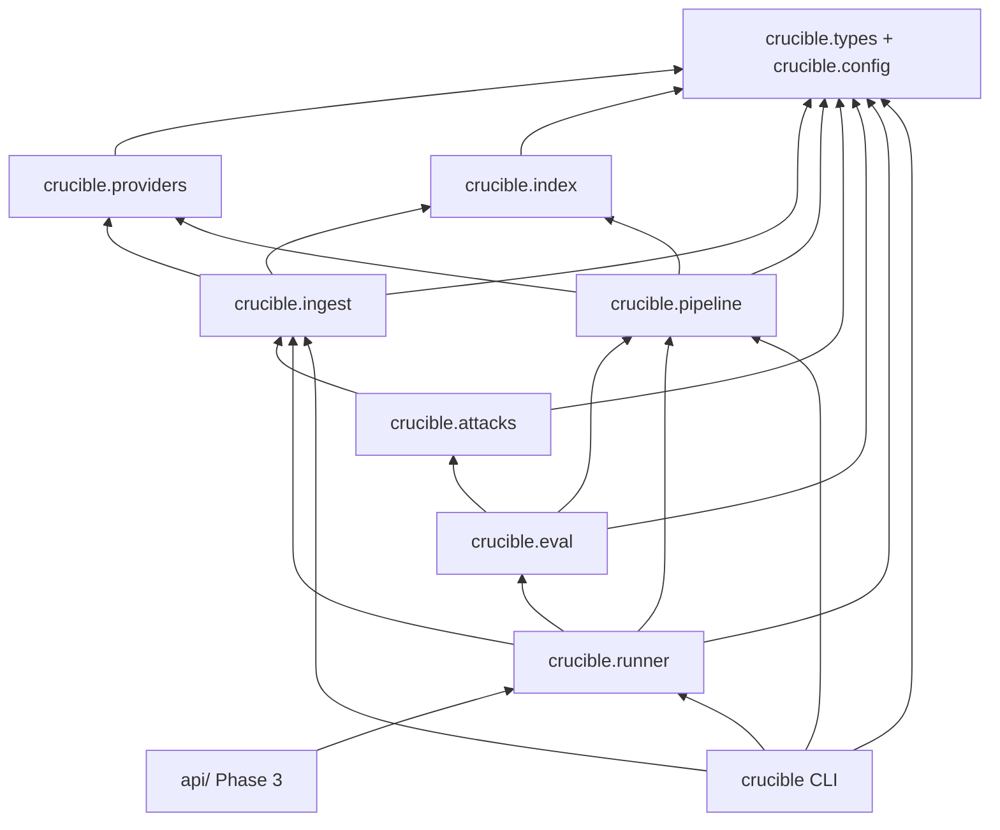

# rag-crucible — Architecture

Companion to [DESIGN.md](DESIGN.md). This file holds the diagrams and the
stage-by-stage data contracts; the rationale behind every decision lives in DESIGN.md.

---

## 1. System context



The CLI, API, and worker are thin shells over one core library. The dashboard is a
read-only HTTP client of the API. Evaluation logic exists in exactly one place:
`crucible/eval/`.

---

## 2. Ingestion pipeline



- Filters are an ordered chain of registered names; each consumes and yields
  `Document`s, so adding a filter never touches its neighbors.
- Chunk identity is deterministic (`sha1(doc_id:start:end)[:16]`), which is what lets
  gold labels, poisoned-chunk tracking, and canary tracking survive re-indexing.
- The attack suites reuse this exact pipeline to build their poisoned indexes — there
  is no second ingestion path.

---

## 3. Query path (the system under test)



Every stage is wrapped in a `StageTimer`; the `Answer` carries per-stage wall time and
token usage, which the runner aggregates into p50/p95 per run.

Defense toggles live in the prompt-build step (`prompt_isolation`) and between
retrieval and prompt-build (`injection_filter` screens candidate chunks) — both are
config flags on `pipeline.defenses`, so the security suite can measure each condition
in one run.

---

## 4. Evaluation run lifecycle





Suites run concurrently (they are independent by construction); items within a suite
run through a bounded asyncio pool sized to provider rate limits.

---

## 5. Module dependency graph (allowed imports)



Arrows mean "may import". Anything not drawn is forbidden — in particular, `eval` may
not import `providers` directly (it consumes the pipeline's public interface only),
and nothing imports from `api/`. `ingest` imports `index` because ingestion *ends* by
building the index (`ingest/build.py`) — there is exactly one index-build path, and
the attack suites reuse it for their poisoned indexes.

---

## 6. Data contracts

The full table and identity rules are in [DESIGN.md §3](DESIGN.md#3-data-contracts-between-stages);
this is the wire-level view of the chain:

```
Document        {doc_id, source, text, meta}
   │  filters (Document → Document)
Chunk           {chunk_id, doc_id, text, start, end, section, tags}
   │  embed(input_type=DOCUMENT)
IndexItem       {chunk_id, vector, payload=Chunk}
   │  search(query_vector, k)
Candidate       {chunk, score, rank}
   │  rerank(query, docs, top_n)   [optional]
RankedContext   {candidates[top_n], rerank_applied}
   │  prompt build (+ defenses) → generate
Answer          {text, citations[], context, usage, timings}
   │  eval suites
EvalRecord      {kind, query_id, payload}      → records table
Metric          {suite, name, variant, value}  → metrics table
SuiteResult     {suite, metrics[], records[]}  → suite_results table
RunResult       {run_id, spec, suite_results, timings}
```

All of these are frozen pydantic models: `Document`/`Chunk` live in `crucible/types.py`
(the dependency root, importable by every module), pipeline-owned models in
`crucible/pipeline/types.py`. Provider-facing results (`EmbedResult`, `RerankResult`,
`GenerateResult`, `Usage`) are defined with the provider interface in
[DESIGN.md §4](DESIGN.md#4-the-provider-abstraction-the-most-important-contract).
